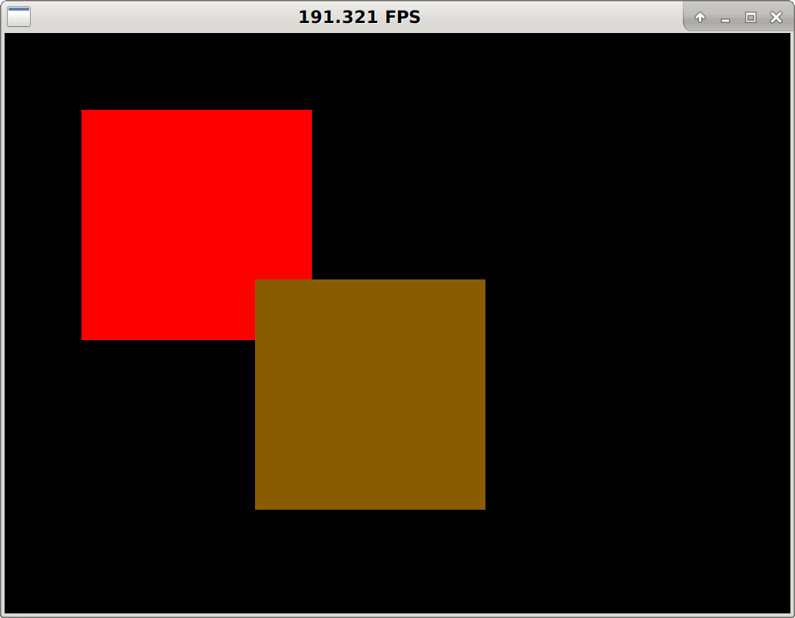

================
2D GUI Framework
================

This is a simple window manager written from scratch.
It uses SDL to draw pixels on the screen, but otherwise draws all the widgets on its own.

Current status:

- Create simple windows consisting of one solid color
- Attach custom mouse event handlers to windows
- The sample app displays two windows that can be focused and dragged

