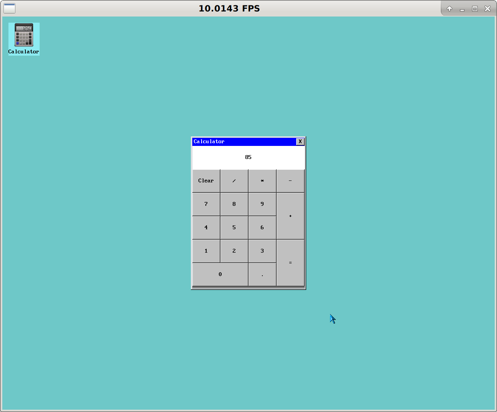

================
2D GUI Framework
================

This is a simple window manager written from scratch.
It uses SDL to draw pixels on the screen, but otherwise draws all the widgets on its own.

Current status:

- Supported controls: form, label, button, grid layout
- Attach custom mouse event handlers to windows
- Support MS-DOS CPI fonts and Windows cursor files
- Sample app that shows a functional calculator

